<style>
section {
  background: #ffffff;
  color: #1a1a1a;
  font-family: "Segoe UI", Helvetica, Arial, sans-serif;
  font-size: 26px;
  line-height: 1.45;
  padding: 56px 64px;
}
h1, h2, h3 { color: #0b3d59; font-weight: 600; }
h1 { font-size: 1.7em; }
h2 { font-size: 1.25em; border-bottom: 1px solid #d0d4d8; padding-bottom: 8px; }
strong { color: #0b3d59; }
code { font-family: Consolas, "Courier New", monospace; font-size: 0.82em; }
pre {
  background: #f5f6f7;
  border-left: 3px solid #0b3d59;
  border-radius: 0;
  padding: 14px 18px;
  font-size: 0.8em;
}
table { font-size: 0.82em; border-collapse: collapse; }
th, td { border: 1px solid #d0d4d8; padding: 6px 12px; text-align: left; }
th { background: #f0f2f4; }
blockquote { border-left: 3px solid #999; color: #444; padding-left: 16px; }
section::after {
  content: attr(data-marpit-pagination) " / " attr(data-marpit-pagination-total);
  color: #888; font-size: 0.55em;
}
ul { margin-top: 0.2em; }
li { margin-bottom: 0.25em; }

/* slides de walkthrough: imagem à esquerda (bg) + coluna estreita à direita.
   Fonte menor p/ o texto caber ao lado do diagrama. */
section.walk { font-size: 21px; }
section.walk h2 { font-size: 1.15em; }
section.walk li { margin-bottom: 0.15em; }
section.walk code { font-size: 0.85em; }

/* slides com código: texto à esquerda, código à direita (grid de 2 colunas). */
section.split .cols { display: grid; grid-template-columns: 40% 60%; gap: 28px; align-items: start; }
section.split.wide .cols { grid-template-columns: 34% 66%; }
section.split.even .cols { grid-template-columns: 1fr 1fr; }
section.split.even .cols > div { text-align: center; }
section.split.pair .cols { grid-template-columns: 1fr 1fr; }
section.split .cols pre { font-size: 0.66em; margin-top: 0; }
section.split .cols ul { font-size: 0.9em; }
section.split .cols p { margin-top: 0; }
section.split .cols blockquote { font-size: 0.85em; margin: 0.4em 0; }
.ref { font-size: 0.6em; color: #66707a; }

/* slide de transição entre seções */
section.divider { display: flex; flex-direction: column; justify-content: center; }
section.divider h2 { border: none; font-size: 1.7em; }
section.divider p { color: #66707a; }
</style>

# Agentes com `create_agent`: determinismo e guardrails em volta do LLM

Conceitos e lições aprendidas

LangChain / LangGraph v1 — projeto de referência

---

## Roteiro

1. Contexto e arquitetura
2. O agente por dentro — ReAct, `create_agent` e o grafo que ele gera
3. Determinismo — Pregel/BSP
4. Contendo a alucinação — camadas, guards, HITL
5. Decisões de arquitetura — `state_schema` × `StateGraph`, supervisor
6. Produção — async e testes
7. Lições e pendências

---

<!-- _class: divider -->

## 1 · Contexto e arquitetura

---

## Contexto e escopo

- Projeto de **referência/estudo**: como construir agentes de IA com `create_agent`
  por trás de um "chassi" genérico (proxy + frontend).
- Metáfora: uma **central de atendimento** ligando o usuário a **um** agente por vez.
  Sem roteamento automático — quem decide é o usuário.
- Dois agentes provam que o chassi é genérico:
  - `agente-despesas` (Rex) — relatórios de despesa.
  - `agente-suporte` (Iris) — chamados de helpdesk.
- O que esta apresentação cobre: onde mora o **determinismo**, como conter
  **alucinação** de modelos fracos, e a migração para **async**.

---

## Arquitetura

<!-- _class: split -->

<div class="cols">
<div>

- `contracts` é a **fronteira**: chassi e frontend **não conhecem o domínio** dos
  agentes. Tudo trafega tipado.
- O chassi é um **proxy** (zero domínio): repassa HTTP e renderiza as dicas de UI do
  agente.
- Cada agente persiste em Postgres por `thread_id` (= `session_id`).

</div>
<div>


</div>
</div>

---

## Ciclo de um `/chat` (com HITL)

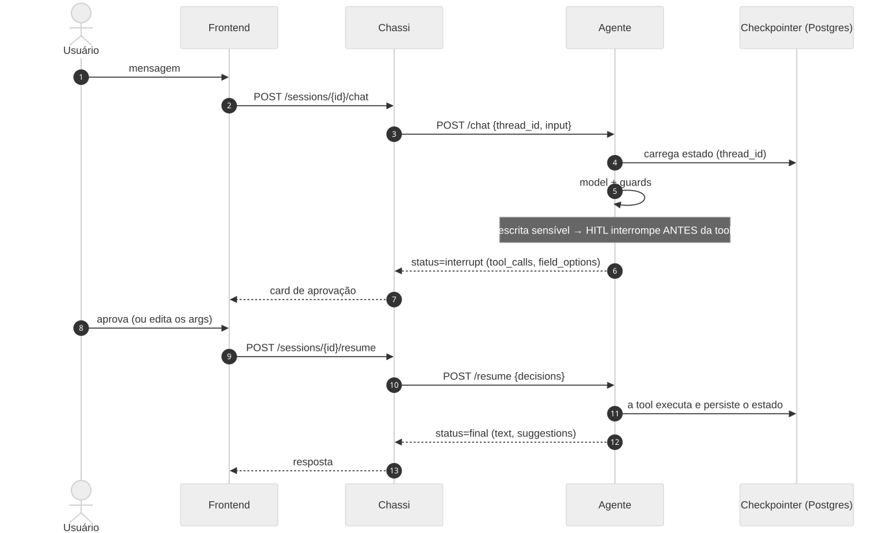

---

<!-- _class: divider -->

## 2 · O agente por dentro

---

## ReAct: raciocinar + agir, em loop


- **Origem:** o paper *ReAct: Synergizing Reasoning and Acting in Language Models*
  (Yao et al., 2022). Em vez de responder de uma vez, o modelo **intercala raciocínio
  e ações**, usando o resultado de cada ação para decidir a próxima.
- No `create_agent`: **Thought + Action** = nó `model`; **Observation** = nó `tools`;
  o ciclo é a aresta `model ↔ tools` que veremos no grafo.

---

## `create_agent` é um loop ReAct, não uma máquina de etapas

<!-- _class: split wide -->

<div class="cols">
<div>

- Recebe **tools**; o **modelo decide** qual chamar e em que ordem — sem garantia de
  sequência.
- "Feche o chamado" → um modelo fraco chama `fechar_chamado` direto, ignorando os
  pré-requisitos.
- **A ordem é decisão do LLM** — é aí que a alucinação aparece.

> A permissão de executar cada tool é decisão nossa, **em código** — não do modelo.

</div>
<div>

```python
create_agent(
    model,              # a LLM
    tools=None,         # o que ele PODE chamar
    *,
    system_prompt=None,
    middleware=(),      # guards, HITL, limites
    state_schema=None,  # estado do domínio
    checkpointer=None,  # persiste por thread_id
    response_format=None,
    ...                 # store, cache, debug, name
) -> CompiledStateGraph   # devolve um GRAFO
```

<span class="ref">reference.langchain.com → agents/factory/create_agent</span>

</div>
</div>

---

## O grafo que o `create_agent` gera

Não é desenho à mão — é o `agent.get_graph().draw_mermaid()` do grafo compilado:


A cadeia `after_model` aparece na **ordem inversa** da lista de middleware
(`Precondition` primeiro, `ToolCallLimit` por último) — visível nas arestas (veremos
o porquê adiante). O ciclo `model ↔ tools` é o loop ReAct.

Nos próximos slides, um nó de cada vez.

---


<!-- _class: walk -->

## `model`

- O nó que chama a **LLM**. É o **único ponto não-determinístico** do grafo: o modelo
  decide se chama tools e quais.
- Recebe o State (mensagens + domínio) e o `system_prompt`; devolve uma `AIMessage`
  com ou sem tool calls.
- Tudo que vem **depois** existe para **conter** o que o `model` decide — ele propõe,
  não tem a palavra final sobre executar.
- Em produção é a LLM local (LM Studio); nos testes, um modelo dublê roteirizado.

---


<!-- _class: walk -->

## `PreconditionMiddleware`

- Primeiro `after_model` a rodar (logo após o `model`). Eixo **por-tool / estado**.
- Para cada tool call, consulta `preconditions[tool](state, args)`; se vier um motivo,
  **remove** a tool call da mensagem.
- Lê o **State do grafo**, nunca uma global → seguro sob concorrência.
- Mata a ação alucinada antes de ela existir (ex.: fechar um chamado inexistente).

---


<!-- _class: walk -->

## `SequentialTurnMiddleware`

- **Turno** = uma mensagem do usuário + a resposta inteira do agente a ela (várias
  tool calls inclusive), até a palavra voltar a ele.
- **Segurar** = tirar a tool call para não rodar agora; o agente diz "próximo passo é
  X, confirme" e a ação fica para o próximo turno.
- Escritas comuns encadeiam (abrir + detalhar); a ação **final** (enviar/fechar) é
  segurada se já houve escrita antes — vira passo deliberado.
- `announce`: função injetada pelo domínio que monta esse texto; o middleware não
  conhece o wording.

---


<!-- _class: walk -->

## `HumanInTheLoopMiddleware`

- A defesa contra o **válido porém errado**. O código barra o inválido (não numérico,
  negativo, fora de faixa, id inexistente); **não** barra `20×20` quando o usuário
  pediu `10×10` — ambos são válidos. Só um humano vê a divergência de intenção.
- **Interrompe** o grafo antes de tools sensíveis (`interrupt_on`); o estado fica
  pausado no checkpointer até a resposta.
- O `/resume` retoma com `Command(resume=...)`: `approve` / `edit` / `reject` — o
  `edit` deixa o usuário **corrigir** o valor antes de executar.
- Os guards rodam antes dele na cadeia: o card só aparece para ações que já passaram
  pelas pré-condições.

---


<!-- _class: walk -->

## `ToolCallLimitMiddleware`

- Último `after_model` a rodar — e, por isso, é dele que saem as **arestas de
  roteamento**: encerrar (`__end__`), repetir o `model`, ou ir às `tools`.
- Conta tool calls por invocação (`run_limit`); ao estourar, bloqueia novas e o turno
  encerra com texto.
- Rede de segurança para modelo fraco em loop; `exit_behavior="continue"` evita a
  exceção que o `"end"` pode levantar com tool calls paralelas.

---


<!-- _class: walk -->

## `tools`

- Executa as tool calls **liberadas** (as funções `@tool`). É onde a ação realmente
  acontece.
- Escritas devolvem `Command(update=...)` → atualizam o State, que o checkpointer
  persiste.
- Volta **sempre** ao `model` (aresta `tools → model`): o modelo vê o resultado e
  decide o próximo passo.
- Anti-alucinação: cada tool valida o estado no início; o `name` do `ToolMessage`
  alimenta o `SequentialTurnMiddleware`.

---

## Cada atributo do `create_agent` vira estrutura no grafo

| Atributo | O que vira no grafo |
|---|---|
| `tools` | nó `tools` + aresta **condicional** `model ↔ tools` (o loop) |
| `middleware=[...]` | nós `*.after_model`, encadeados na **ordem inversa** |
| `HumanInTheLoopMiddleware` | ponto de **interrupção** antes da tool sensível (HITL) |
| `state_schema` | o **State** que percorre as arestas (e é persistido) |
| `checkpointer` | persiste o State entre invocações, pelo `thread_id` |

O agente não é uma caixa-preta: é um grafo inspecionável, e cada decisão de
composição tem um reflexo estrutural que dá para ler e versionar.

---

<!-- _class: divider -->

## 3 · Determinismo — Pregel/BSP

---

## Onde mora o determinismo

Duas camadas distintas, frequentemente confundidas:

- **Runtime do LangGraph (Pregel/BSP):** garante que a ordem de execução e a
  latência dos nós nunca alterem a saída. É o que evita corrida de dados em nós
  paralelos. Não é uma flag do `create_agent`.
- **Controle de fluxo da aplicação:** a sequência "A depois B" entre agentes/etapas
  é código Python ou arestas de grafo — responsabilidade nossa.

O `create_agent` não sabe nada sobre "A depois B". Ele resolve **uma** etapa
(o loop modelo ↔ tools) e nos dá ganchos (middleware) para conter o que vaza.

---

## Pregel / BSP — de onde vem o determinismo


- **BSP (Bulk Synchronous Parallel)** — Leslie Valiant, **1990**: computação em
  *supersteps* (cálculo local → troca de mensagens → **barreira**). A ordem dos nós
  dentro do superstep não altera o resultado.
- **Pregel** — Google, **2010**: BSP aplicado a grafos gigantes ("think like a
  vertex"). O nome vem do **rio Pregel de Königsberg** — o das pontes de Euler, berço
  da teoria dos grafos.
- **LangGraph**: runtime inspirado nisso — nós = vértices, estado = canais; updates
  aplicados na barreira em **ordem determinística**, e com suporte a **loops** (≠ DAG).

**Por que importa na prática:** é o que garante que dois usuários agindo ao mesmo tempo
não corrompam o estado do agente — a variabilidade do LLM nunca vira bug do framework.

---

<!-- _class: divider -->

## 4 · Contendo a alucinação

---

## Anti-alucinação não vive no prompt

<!-- _class: split -->

<div class="cols">
<div>


</div>
<div>

Cada camada pega o que a anterior deixou passar. Só as **hard** (código) não dependem da boa vontade do modelo:

- **soft** — o `system_prompt` orienta, mas o modelo pode ignorar.
- **hard** — a tool valida o estado e o gate intercepta a ação: rodam **independentemente** do que o modelo "quis".

```python
# tool: valida o estado, não confia no argumento
def motivo_bloqueio_fechamento(state, args) -> str | None:
    # motivo do bloqueio (str) ou None se pode rodar
    ...
```

</div>
</div>

---

## O agente não é a fonte da verdade

As camadas anteriores pertencem à aplicação do agente. A última está fora dela: a
**API por trás da tool**.

- Em produção, a tool aciona um serviço que deve **barrar estados inválidos por conta
  própria**, sem confiar no chamador.
- As **invariantes de negócio vivem no backend**, não no prompt nem no middleware. O
  agente pode ter bugs, ser substituído ou alucinar; a API continua correta.

O agente é uma **camada de experiência, não de autoridade**:

- Teste mental: substitua o agente por um frontend tradicional. Se o sistema continua
  correto, as regras estão no lugar certo.

---

## Guards genéricos — uma responsabilidade cada

<!-- _class: split -->

<div class="cols">
<div>

Moram em `contracts`, **agnósticos de domínio**. Cada agente injeta a política.
Dois middlewares pequenos em vez de um que faz as duas coisas:

- `preconditions`: `{tool: fn(state, args) -> str | None}` — lê o **estado do grafo**.
- `announce`: o middleware não conhece texto de tela; o domínio injeta a mensagem.

</div>
<div>

```python
# pode rodar dado o ESTADO?
PreconditionMiddleware(
    preconditions={
        "fechar_chamado": motivo_bloqueio_fechamento,
    },
)

# ação irreversível exige turno próprio
SequentialTurnMiddleware(
    write_tools=WRITE_TOOLS,
    sequential_tools=SEQUENTIAL_TOOLS,
    announce=_anuncia_proximo_passo,  # wording vem do DOMÍNIO
)
```

</div>
</div>

---

## Barrar no `after_model`, não no `wrap_tool_call`

<!-- _class: split even -->

Ambos interceptam tool calls; a diferença é **quando** — e, com HITL, isso decide se o
card de aprovação chega a aparecer:

<div class="cols">
<div>

**`after_model`** — bloqueia **antes** do card


</div>
<div>

**`wrap_tool_call`** — bloqueia **depois** do card


</div>
</div>

---

## Ordem do middleware importa

<!-- _class: split wide -->

<div class="cols">
<div>

- `after_model` roda em **ordem inversa** da lista (como middleware de servidor web).
- Por isso os guards vêm **depois** do HITL na lista: seu `after_model` executa
  **antes**, barrando o envio prematuro antes de o card HITL aparecer.

**Declaração** lê de cima ↓ &nbsp;·&nbsp; **`after_model`** executa de baixo ↑

</div>
<div>

```python
middleware=[                          # declara ↓
    ToolCallLimitMiddleware(...),     #          after_model
    HumanInTheLoopMiddleware(...),    #          executa  ↑
    SequentialTurnMiddleware(...),    #          (de baixo
    PreconditionMiddleware(...),      # ⟵ 1º     p/ cima)
]
```

</div>
</div>

---

## Human-in-the-loop (HITL)

```python
HumanInTheLoopMiddleware(interrupt_on={t: True for t in HITL_TOOLS})
```

- Interrompe **antes** de tools sensíveis (toda escrita pede aprovação).
- O `/resume` traduz a decisão do usuário (`approve` / `edit` / `reject`) no payload
  do middleware e retoma com `Command(resume=...)`.
- `edit` permite ao usuário corrigir os argumentos na tela antes de executar —
  inclusive trocar valores via seletores (`field_options`, de-para id↔nome).

---

## Estado no grafo, não em variável global

<!-- _class: split -->

<div class="cols">
<div>

- O domínio (`chamados`, `relatorios`) vive no `state_schema` → o **checkpointer
  Postgres** o persiste junto com as mensagens, pelo mesmo `thread_id`.
- A conversa reabre completa após restart ou em outro dispositivo.
- O gate lê `state`, **nunca** uma global.

Esse detalhe deixou de ser teórico ao migrarmos para async/multiusuário.

</div>
<div>

```python
# CORRETO: lê o state do grafo
def motivo_bloqueio(state, args):
    ...

# ERRADO: global quebra com
# execuções concorrentes
# (múltiplos usuários, async)
_GATE = {...}
```

</div>
</div>

---

## Modelos fracos: rede de segurança contra loops

<!-- _class: split -->

<div class="cols">
<div>

- Modelo fraco às vezes repete a mesma tool indefinidamente.
- Ao estourar o limite, a tool é **bloqueada** (`exit_behavior="continue"`, o default)
  e o turno encerra com texto — sem exceção.
- Evitamos o `exit_behavior="end"`: pode levantar `NotImplementedError` com tool calls
  paralelas.
- Fluxo legítimo faz poucas tool calls por turno; `10` dá folga e ainda corta loops.

</div>
<div>

```python
ToolCallLimitMiddleware(
    run_limit=10,  # por invocação
)
```

</div>
</div>

---

## Mesmo input, dois modelos — onde o código segurou

<!-- _class: split pair -->

Pergunta idêntica: *"Quero registrar uma despesa"* (sem dar título nem tipo).

<div class="cols">
<div>

**Modelo forte (OpenAI)**

Pergunta o título e o tipo, lista as opções, conciso. **Não aciona nenhum guard** — o
`system_prompt` já basta.

</div>
<div>

**Modelo fraco (qwen 7b, local)**

Narra "passos", se repete e **tenta abrir o relatório sem os dados**. A pré-condição
barra **antes do card** e responde por ele:

> *"Para abrir um relatório eu preciso do título. Qual nome você quer dar a ele?"*

</div>
</div>

O **código nivela por baixo**: o prompt ajuda os bons; o gate garante o **piso** quando
o modelo falha. A fluência continua sendo do modelo — o guard cuida da **correção**.

---

<!-- _class: divider -->

## 5 · Decisões de arquitetura

---

## `state_schema` não é `StateGraph`

Confusão comum de nomes. São coisas diferentes:

| `state_schema` | `StateGraph` |
|---|---|
| Parâmetro do `create_agent` | Classe do LangGraph (`langgraph.graph`) |
| Define o **formato** do estado (TypedDict) | Você **desenha** nós e arestas |
| Campos além de `messages` | Topologia explícita do fluxo |
| Não é um grafo | É uma **alternativa** ao `create_agent` |

```python
class ChamadoState(AgentState):
    chamados: Annotated[dict[str, dict], merge_chamados]  # persiste no checkpointer
```

---

## `create_agent` + gate vs `StateGraph`

| `create_agent` + gate | `StateGraph` |
|---|---|
| Modelo escolhe a ordem; gate veta violações | Ordem é a **topologia** (`START→a→b→END`) |
| Flexível: caminhos variam por turno | Rígido: sequência fixa e inegociável |
| Bom p/ assistentes (helpdesk, despesas) | Bom p/ pipeline fixo (ex.: construir casa) |

- Nosso domínio é **flexível** (às vezes só adicionar um item; às vezes abrir vários;
  às vezes não enviar). Um grafo linear engessaria o que precisa ser livre.
- Os dois se combinam: um **nó** de `StateGraph` pode ser, ele próprio, um
  `create_agent` — esqueleto rígido com bolsões de autonomia.

---

## Decisão: central de atendimento, não supervisor

O padrão **supervisor** (doc LangChain): um LLM com os subagentes como tools, roteando
**automaticamente** e sintetizando resultados. Avaliamos e **não** adotamos.

| | Supervisor | Nosso chassi |
|---|---|---|
| Roteamento | o **LLM** decide (automático) | o **usuário** decide (`router_llm` só sugere) |
| Subagentes | tools in-process num grafo | serviços HTTP **independentes** |
| Estado | grafo do supervisor | checkpointer por agente / `thread_id` |
| Pedido multi-agente | nativo | fora de escopo (um por vez) |

- Supervisor = **mais um LLM dono de uma decisão** → mais uma superfície de alucinação.
  Roteamento pelo usuário é determinístico e auditável (coerente com "não é a fonte da verdade").
- Seria a escolha certa para pedidos que **cruzam vários agentes** — e daria para adotá-lo
  como *mais um agente* atrás do chassi, sem quebrá-lo (padrão aninhado).

---

<!-- _class: divider -->

## 6 · Produção — async e testes

---

## Migração para async: tudo ou nada

- Motivação: escalar para **múltiplos usuários simultâneos** (throughput, não latência
  de uma requisição isolada).
- Regra que aprendemos: uma **meia-migração** (httpx async + DB síncrono) é **pior**
  que tudo síncrono — bloqueia o event loop.
- Migração completa, ponta a ponta:
  - `httpx.AsyncClient`
  - `AsyncConnectionPool` + `AsyncPostgresSaver` + `await`
  - `agent.ainvoke` / `agent.aget_state`
  - endpoints FastAPI `async def` + `lifespan` assíncrono

---

## Async: detalhes que mordem

<!-- _class: split wide -->

<div class="cols">
<div>

- `open=False` e abrir o pool no `lifespan`/`warmup` — abrir fora do loop emite
  warning.
- **Windows:** o psycopg async não roda no `ProactorEventLoop` (default do uvicorn).
  Forçar o loop na CLI — **definir a policy no código é ignorado no uvicorn 0.36+**.
- No Linux/Docker **não** passe a flag: deixe o uvloop (mais rápido) ser escolhido.

</div>
<div>

```python
# pool aberto DENTRO do event loop
# (no warmup), não no construtor
pool = AsyncConnectionPool(
    conninfo=...,
    open=False,   # ⟵ abre no warmup
    kwargs={"autocommit": True,
            "prepare_threshold": 0},
)
return AsyncPostgresSaver(pool)
```

```bash
# só no Windows
uvicorn app.main:app \
  --loop asyncio:SelectorEventLoop
```

</div>
</div>

---

## Testes: mesma fiação de produção, sem infra

<!-- _class: split wide -->

<div class="cols">
<div>

- LLM **dublada** (`ScriptedModel`): cada AIMessage do roteiro é a "decisão" do modelo
  naquele passo → ciclos determinísticos.
- `MemorySaver` no lugar do Postgres; Langfuse e pool mockados.
- `build_agent(model, checkpointer)` é a **fonte única** da composição: o teste injeta
  dublês, mas exercita o mesmo middleware/tools/prompt da produção.
- `pytest-asyncio` com `asyncio_mode = auto`. Cobertura em **100%**.

</div>
<div>

```python
# fiação real, deps dubladas
def make_agent(script):
    return build_agent(
        ScriptedModel(
            messages=iter(script),
        ),
        MemorySaver(),
    )
```

</div>
</div>

---

<!-- _class: divider -->

## 7 · Lições e pendências

---

## Lições aprendidas

- `create_agent` não garante ordem de tools — o LLM decide; o **código** garante.
- O agente é **camada de experiência, não de autoridade**: a última defesa é a
  **API por trás da tool**, e as invariantes vivem no backend.
- Política de ordem/segurança vive em **código determinístico** (tool + middleware),
  não no prompt.
- Em fluxo com HITL, **onde** se barra importa: `after_model` antes do card.
- Estado no grafo + checkpointer; nunca estado em global (concorrência).
- Async é tudo-ou-nada; meia-migração regride.
- Sistemas com modelo fraco precisam de **rede de segurança** (limite de tool calls).

---

## Pendências e próximos passos

- Medir **throughput sob concorrência** (múltiplos usuários) — o ganho real do async
  ainda não foi medido objetivamente.
- Avaliar `ModelRetryMiddleware` / `ModelFallbackMiddleware` para robustez extra com
  modelos locais.
- Referências no repositório:
  - `agente-despesas/AGENTS.md` — seção "Perguntas frequentes (mental model)".
  - `contracts/contracts/middleware.py` — guards de fluxo comentados.
  - `AGENTS.md` (raiz) — visão geral e comandos.
